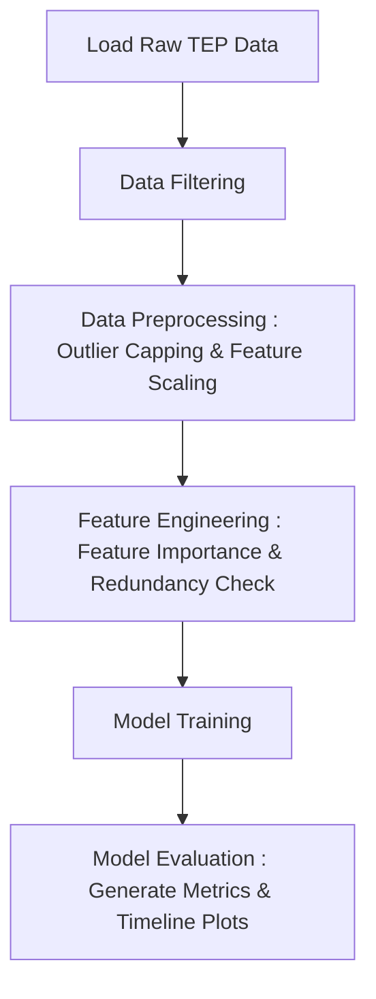
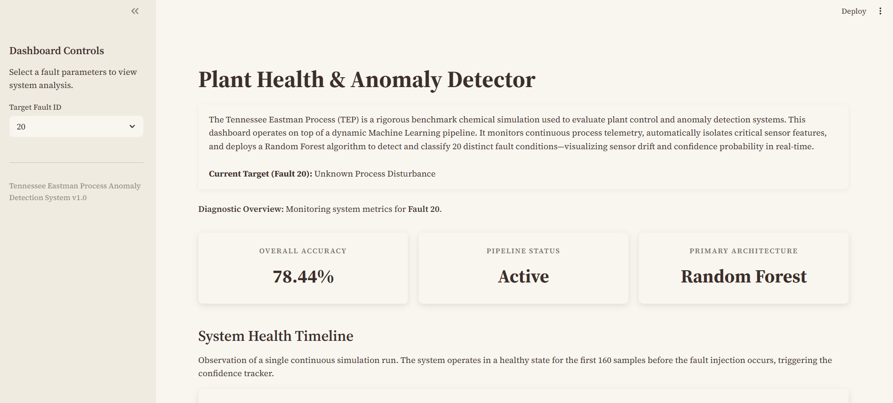
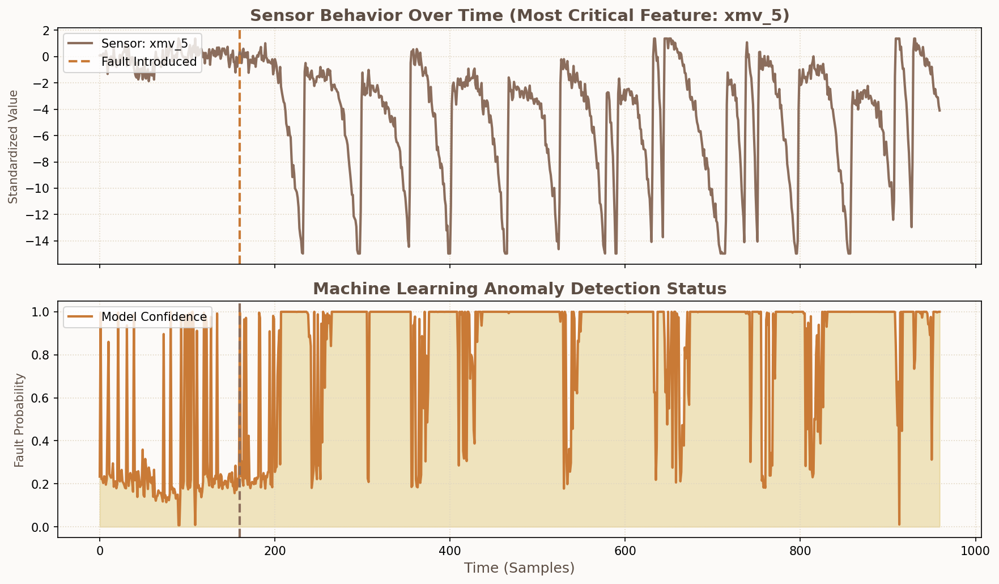

# Tennessee Eastman Process Anomaly Detection

This project presents a robust, end-to-end machine learning pipeline for detecting chemical process anomalies within the **Tennessee Eastman Process (TEP)** dataset using:

- **Dynamic Fault Detection** to identify continuous process disturbances across 20 distinct fault conditions.
- **Robust Preprocessing** pipelines to handle gigabytes of data with memory-optimized sequential loading, outlier capping, and feature scaling.
- **Dynamic Feature Selection** leveraging Random Forest feature importances and correlation matrices to isolate critical sensors and eliminate multicollinearity.
- **Interactive Monitoring** via a premium Streamlit dashboard featuring system health timelines and real-time inference tracking.

---

## Pipeline Overview



---

## Project Structure
The repository is structured for modularity, separating configuration, source code, artifacts, and the frontend application.
```text
├── .streamlit/
│   └── config.toml              <- Global theme configuration (Light/Dark mode)
├── data/
│   ├── raw/                     <- Original TEP .RData files (User provided)
│   └── processed/               <- Cleaned, scaled, and feature-selected CSVs
├── models/                      <- Serialized Random Forest and Scaler objects (.pkl)
├── reports/                     <- Evaluation metrics (.json) and Timeline plots (.png)
├── src/
│   ├── __init__.py
│   ├── config.py                <- Master configuration (paths, hyperparameters, targets)
│   ├── data_loader.py           <- Memory-efficient sequential data parsing
│   ├── preprocess.py            <- Outlier capping, scaling, and feature isolation
│   ├── model.py                 <- Random Forest initialization and training
│   ├── evaluate.py              <- Model scoring and visual timeline generation
│   └── main.py                  <- Master orchestrator executing the pipeline
├── app.py                       <- Premium Streamlit interactive dashboard
├── requirements.txt             <- Python dependencies
└── README.md
```

---

## Core Modules & Architecture

### Backend Pipeline (src/)
- `config.py`: The central nervous system of the pipeline. Controls the `TARGET_FAULT`, file paths, quantile thresholds, and Random Forest hyperparameters.

- `data_loader.py`: Filters data depending on the `TARGET_FAULT` from the raw data files.

- `preprocess.py`: Applies percentile-based capping and fits a `StandardScaler` strictly on normal data. It then deploys a lightweight baseline model to extract the top 10 most critical sensors, automatically dropping redundant features with > 0.90 correlation.

- `evaluate.py`: Generates a standard classification report and a dynamic **System Health Timeline plot**, capturing the exact moment the simulation transitions from a normal state into an anomalous one.

### Frontend Dashboard (app.py)
A custom-styled, interactive **Streamlit** application serving as the process monitoring UI.

<p align="center"> 
   
</p>

- Dynamic Loading: Automatically retrieves and renders the specific metrics, hardware descriptions, and timeline plots for the fault selected in the sidebar.

- Background Training: Features a dynamic UI trigger that spawns a subprocess to execute `src/main.py` in the background, streaming terminal logs and updating a live progress bar without freezing the app.

---

## Results and Visualization

Instead of static confusion matrices, the system generates a **System Health Timeline** for every fault. 

<p align="center"> 
   
</p>

This dual-plot visualizes the physical drift of the plant's most critical sensor alongside the Machine Learning model's real-time confidence probability.

*Note: The model correctly maintains 0% fault probability during the first 160 samples (normal operation) before immediately spiking when the anomaly is injected.*

---

## How to Run the Project
- Step 1: Environment Setup
Ensure you are using Python 3.9+ and install the required packages:
```bash
pip install -r requirements.txt
```

- Step 2: Data Placement
Ensure the official *Tennessee Eastman Process .RData* files are placed exactly in the `data/raw/` directory:

`TEP_FaultFree_Training.RData`
`TEP_FaultFree_Testing.RData`
`TEP_Faulty_Training.RData`
`TEP_Faulty_Testing.RData`

- Step 3: Run the Dashboard
Launch the frontend application.
```bash
streamlit run app.py
```
From the dashboard UI, you can select any of the 20 TEP faults from the sidebar. If the model has not been trained for that fault yet, simply click the *Run Diagnostic Pipeline* button directly in the app to watch the system train dynamically.

- Step 4: Run Headless (CLI only)
If you prefer to train models without the UI, update the `TARGET_FAULT` variable in `src/config.py`, then execute the pipeline orchestrator:
```bash
python src/main.py
```